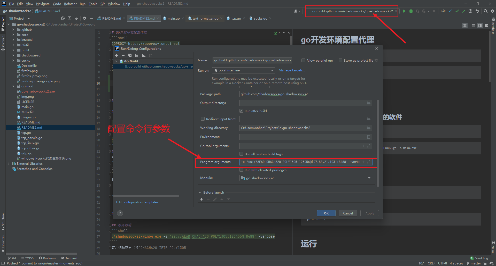
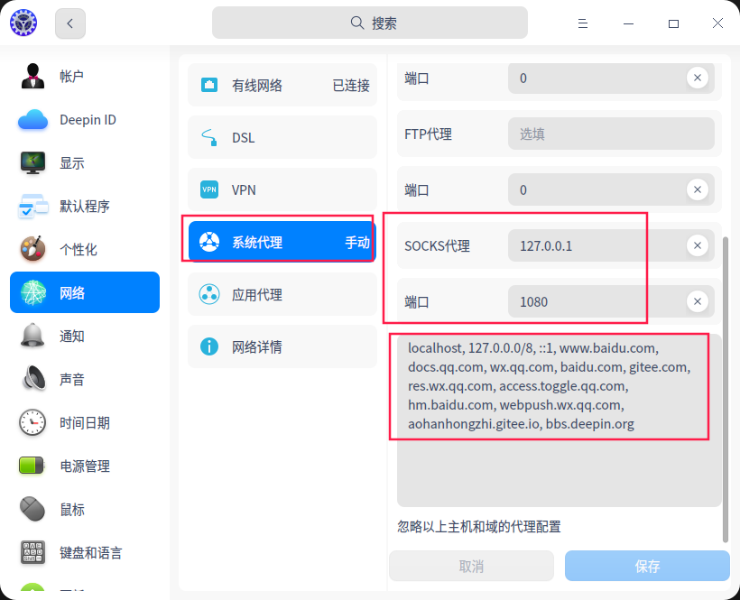
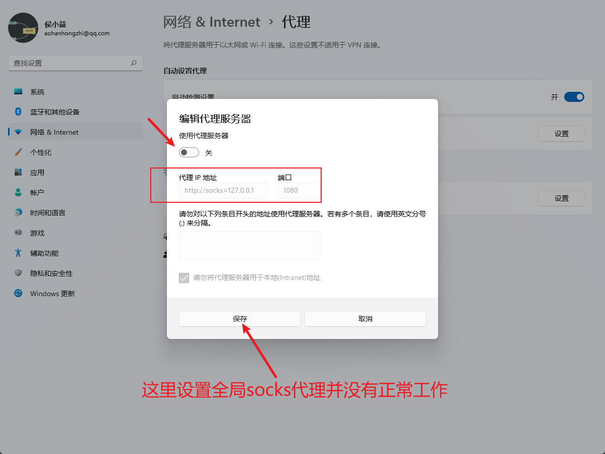
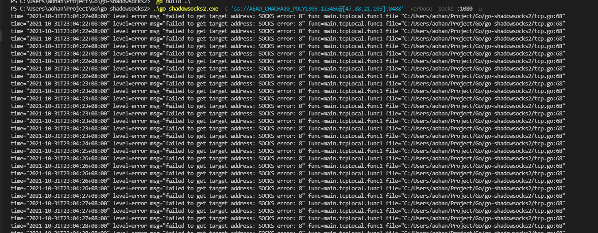
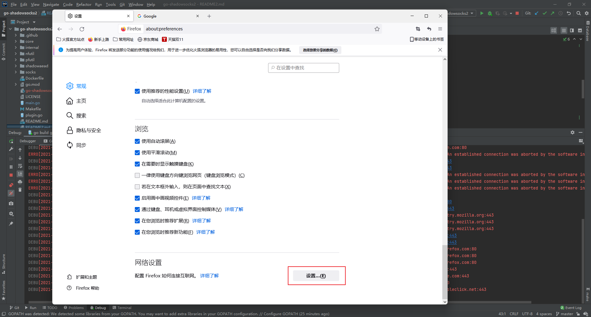
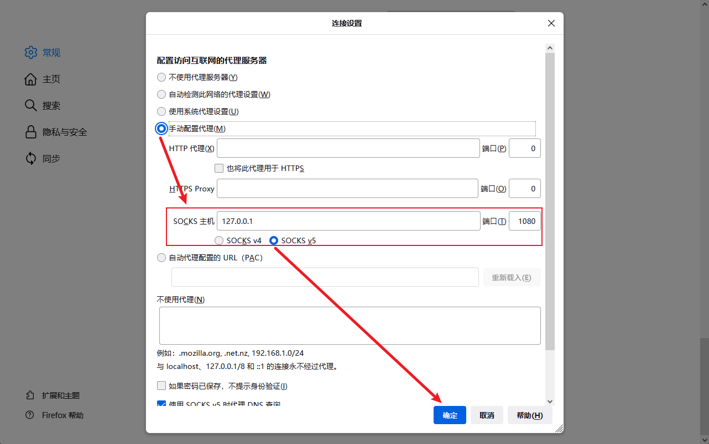
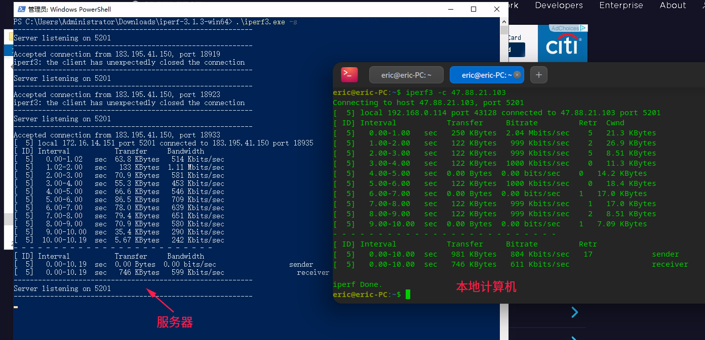
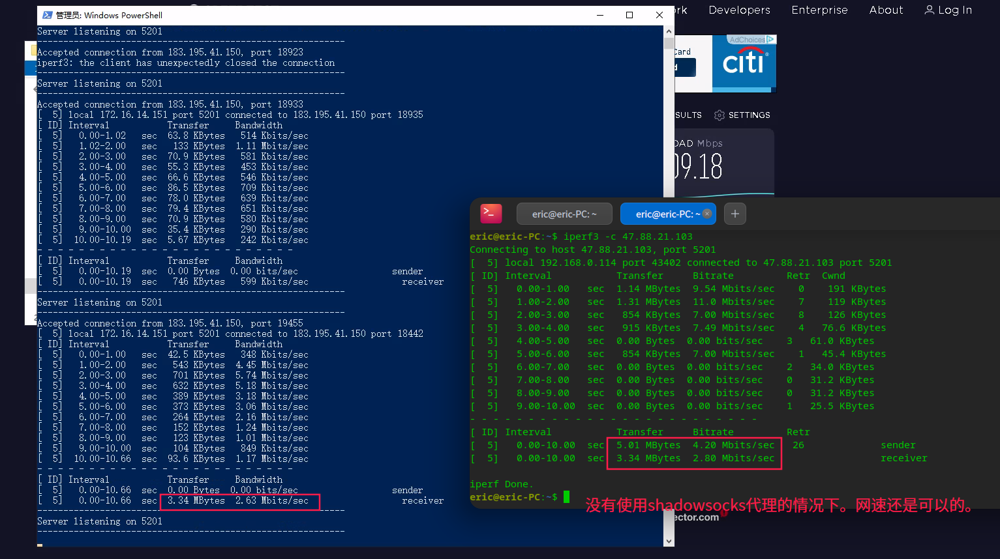

# shadowsocks官网有全平台终端

有客户端和server端

https://shadowsocks.org/en/download/clients.html

# go开发环境配置代理

[windows服务器下搭建梯子shadowsocks](https://docs.qq.com/doc/DSHhDYkFHRU56a3ph)

本项目原地址：https://github.com/shadowsocks/go-shadowsocks2

```shell
GOPROXY=https://goproxy.cn,direct
```

```
go mod download
```




# 打包

## linux下打包windows服务器的软件
```shell
 CGO_ENABLED=0 GOOS=windows GOARCH=amd64
```
```shell
go build main.go tcp.go udp.go  plugin.go tcp_linux.go -o main.exe
```
## windwos下打包
运行
```
go run .\
```
打包
```
 go build .\
```


# 运行

## 服务器端
```shell
.\shadowsocks2-win64.exe -s 'ss://AEAD_CHACHA20_POLY1305:123456@:8488' -verbose
```
客户端加密方式是`CHACHA20-IETF-POLY1305`

## 客户端
```shell
-c 'ss://AEAD_CHACHA20_POLY1305:123456@[47.88.21.103]:8488' -verbose -socks :1080 -u
```
加上日志级别
```shell
-loglevel debug
```
密码加密方式要一样啊。
```shell
./go-shadowsocks2 -c 'ss://AEAD_AES_256_GCM:AmtB2BWzJh@[159.223.92.56]:22906' -verbose -socks :1080 -u --loglevel debug
```
### deepin配置socks5代理




# 日志设置
写入到本地磁盘，目前已经切换到logrus了。

> https://www.jianshu.com/p/cfb7fb34bee5

# 绕过局域网及大陆


# windows下异常

golang.org/x/sys/windows.WSAECONNABORTED (10053)

## 解决办法
可能是系统不支持，但是firefox支持。




# 测速

[使用iperf测试两台电脑之间的网速](https://www.jianshu.com/p/904a919db6ef):注意版本2和3,一般是3.

https://iperf.fr/iperf-download.php

网速问题

https://github.com/shadowsocks/go-shadowsocks2/issues/219



#  BBR是google研发的一种拥塞控制算法-加速
https://www.iq97.com/jishubiji/20210708/125.html


